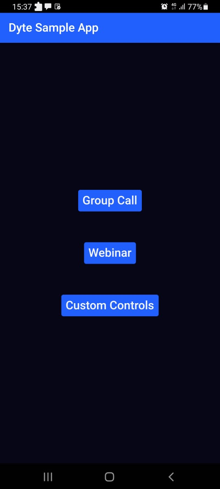
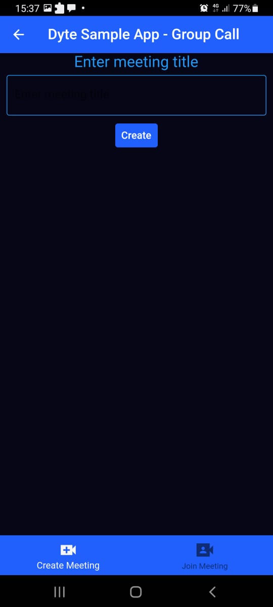
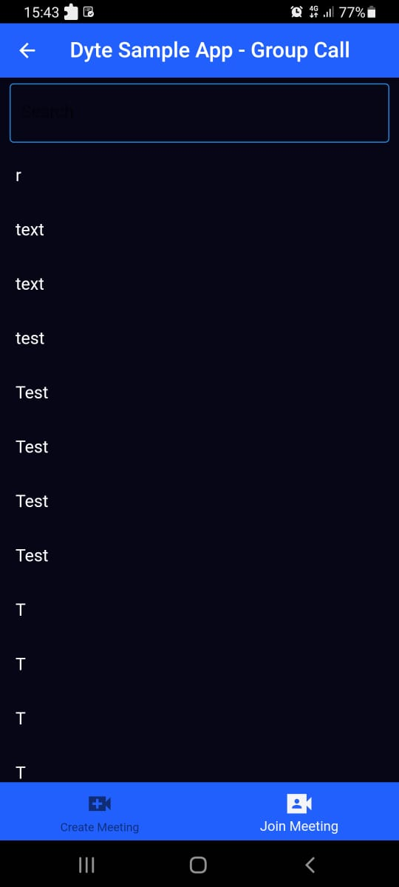
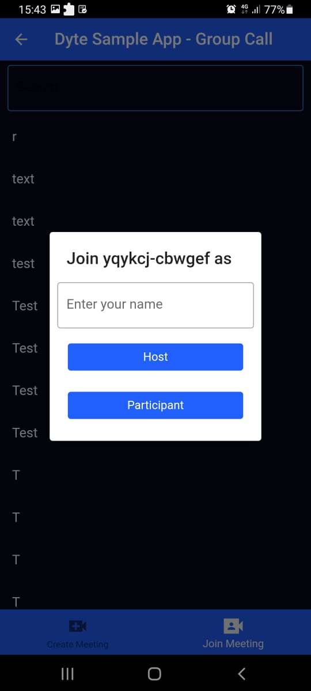

<!-- PROJECT LOGO -->
<p align="center">
  <a href="https://dyte.io">
    
  </a>

  <h2 align="center">Flutter Sample App by dyte</h3>

  <p align="center">
   Sample App to demonstrate Dyte SDK in flutter
    <br />
    <a href="https://docs.dyte.io/flutter/quickstart"><strong>Explore the docs »</strong></a>
    <br />
    <br />
    <a href="https://app.dyte.io">View Demo</a>
    ·
    <a href="https://github.com/dyte-in/docs-template/issues">Report Bug</a>
    ·
    <a href="https://github.com/dyte-in/docs-template/issues">Request Feature</a>
  </p>
</p>

<!-- TABLE OF CONTENTS -->

## Table of Contents

- [About the Project](#about-the-project)
  - [Built With](#built-with)
- [Getting Started](#getting-started)
  - [Prerequisites](#prerequisites)
  - [Installation](#installation)
- [Version History](#version-history)
- [Contributing](#contributing)
- [Support](#support)
- [License](#license)
- [About](#about)

<!-- ABOUT THE PROJECT -->

## About The Project

   

### Built With

Primarily

- [Dyte Sdk](https://pub.dev/packages/dyte_client)
- [Flutter](https://flutter.dev/)
- [http package](https://pub.dev/packages/http)
- [uuid package](https://pub.dev/packages/uuid)
- :heart:

<!-- GETTING STARTED -->

## Getting Started

To get a local copy up and running follow these simple steps.

### Prerequisites

- Flutter, installation and setup can be done from [here](https://docs.flutter.dev/get-started/install)

- A working backend that can connect to Dyte APIs
  - This app currently connects to our sample backend implementation (https://github.com/dyte-in/sample-app-backend), currently hosted at https://dyte-sample.herokuapp.com - this can be grepped and replaced if you want it to work with your own backend implementation

### Installation

1. Clone the repo

```sh
https://github.com/dyte-in/flutter-sample-app
```

2. Install packages

```sh
flutter pub get
```

#### Run

`flutter run`

<!-- CHANGELOG -->

## Version History

See [CHANGELOG](./CHANGELOG.md).

<!-- CONTRIBUTING -->

## Contributing

Contributions are what make the open source community such an amazing place to be learn, inspire, and create. Any contributions you make are **greatly appreciated**. Sincere thanks to all [our contributors](https://github.com/dyte-in/flutter-sample-app/graphs/contributors)!

You are requested to follow the contribution guidelines specified in [CONTRIBUTING.md](./CONTRIBUTING.md) and code of conduct at [CODE_OF_CONDUCT.md](./CODE_OF_CONDUCT.md) while contributing to the project :smile:.

## Support

Contributions, issues, and feature requests are welcome!
Give a ⭐️ if you like this project!

<!-- LICENSE -->

## License

Distributed under the Apache License, Version 2.0. See [`LICENSE`](./LICENSE) for more information.

<!-- MARKDOWN LINKS & IMAGES -->
<!-- https://www.markdownguide.org/basic-syntax/#reference-style-links -->

## About

`flutter-sample-app` is created & maintained by Dyte, Inc. You can find us on Twitter - [@dyte_io](twitter.com/dyte_io) or write to us at `dev [at] dyte.io`.

The names and logos for Dyte are trademarks of Dyte, Inc.

We love open source software! See [our other projects](https://github.com/dyte-in) and [our products](https://dyte.io).
